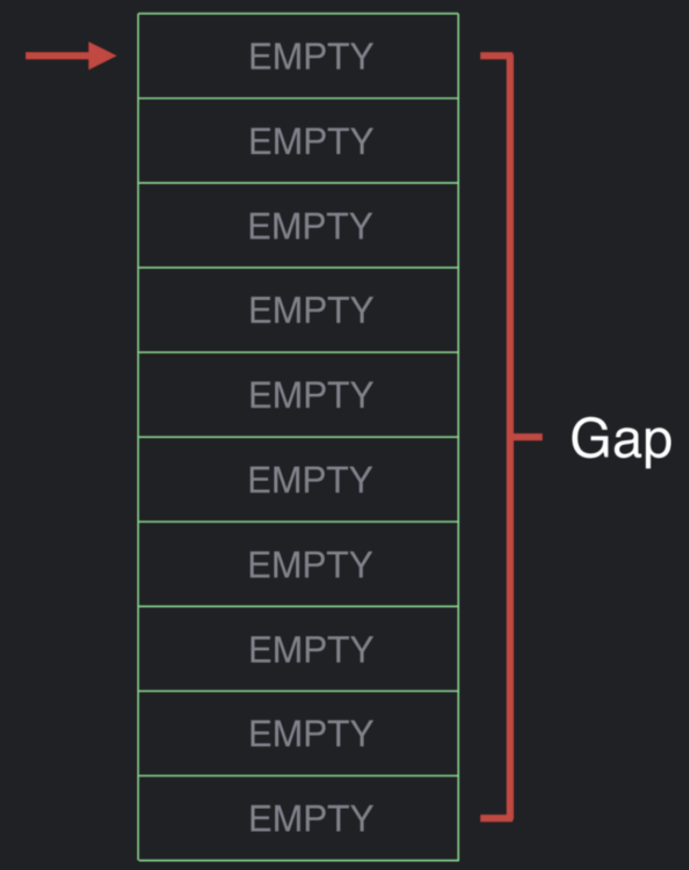
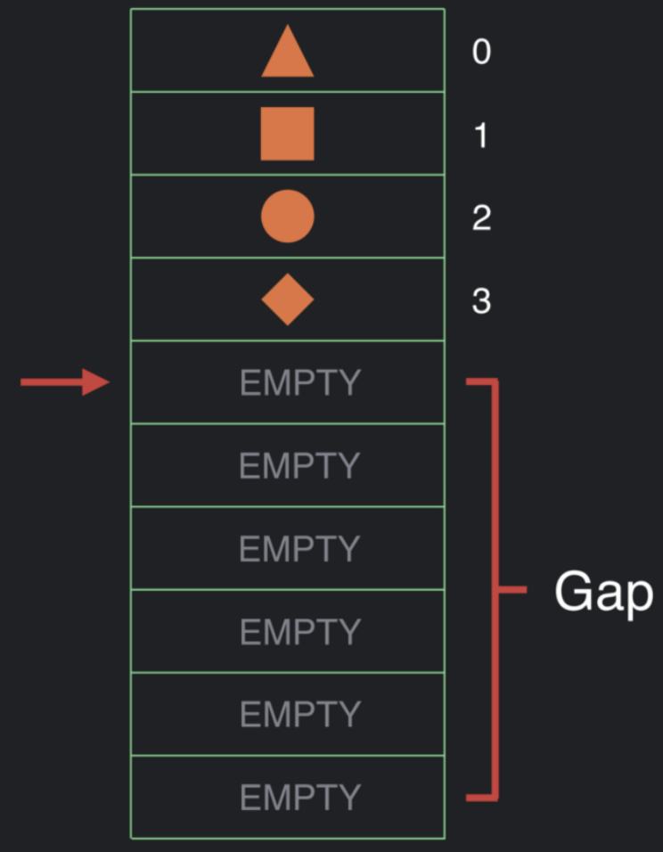
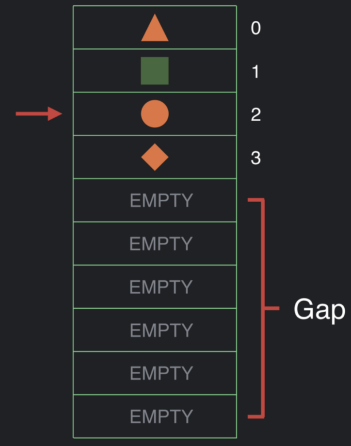
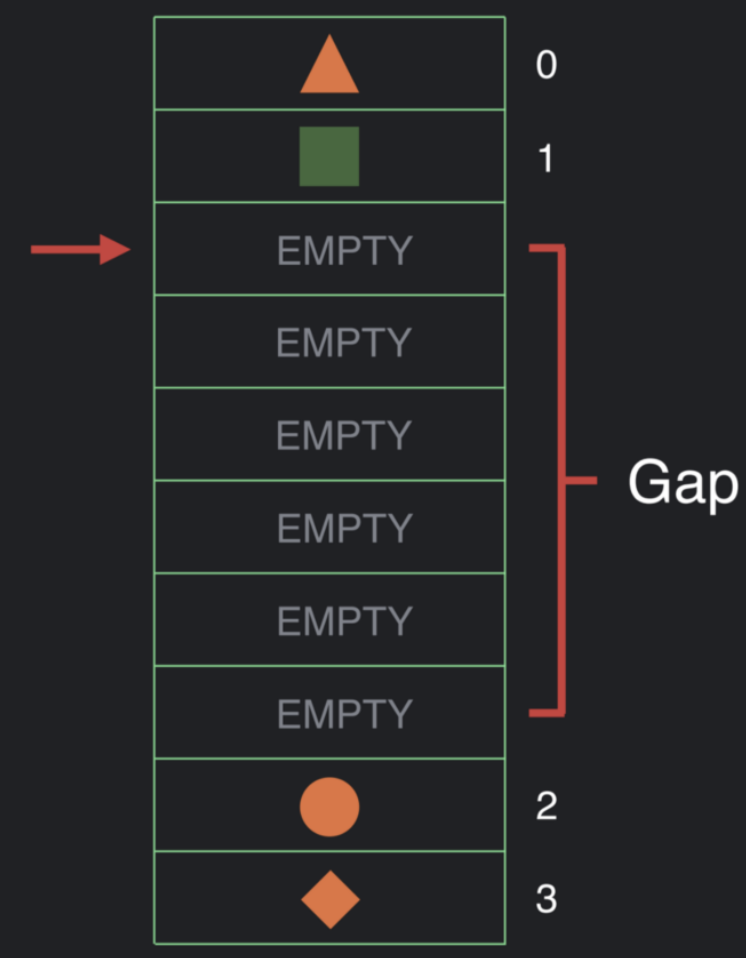

컴포즈에서 이용되는 데이터들을 저장하기 위해서 **slot table**을 활용합니다.

## Slot Table

**slot table** 은 Gap Buffer 자료구조와 Array 자료구조를 활용한 클래스라고 생각하면 간단하다.  
배열의 단점은 사이즈가 고정되어 있고 찾으려면 직접 처음부터 찾아봐야한다. 그로 인해 O(N)이라는 시간복잡도를 가지게 된다. 컴포즈는 리컴포지션이 잦게 발생한다. 모든 연산이 O(N)이 발생한다면, 느려지게 된다. 그래서 O(1) 기대하게 된다. 배열의 단점을 극복하고자 Gap Buffer 자료구조를 활용해 **slot table** 을 이용한다.


> `slot table`은 Gap Buffer 자료구조를 기반으로 빠른 선형 접근에 최적화된 메모리 구조이다.

- slot table은 컴포지션에 대한 모든 정보들이 저장된다.
- slot table은 2가지의 선형 배열을 가지고 있다. `group`과 `slot`이다.

### group

slot table에 특정 도메인에 속한 데이터가 저장되는 범위이다. 예로 들면, State, Modifier, CompositionLocal ...이 존재한다.  

> 컴포저블의 그룹에 대한 메타데이터를 제공하는 그룹 필드에 대한 값만 저장하며 IntArray 타입으로 관리한다.

모든 컴포저블은 slot table에 저장됩니다.
```kotlin
Text(text = "stitch")
```
위의 코드처럼 컴포저블이 표시하는 데이터 "stitch"을 slot table의 저장하기 까지의 상위 컴포저블들을 group이라고 부릅니다.

group는 3가지로 분류가 됩니다.
1. **RestartableGroup**
  - 리컴포지션하는 방법을 알려줍니다.
  - 모든 컴포저블에 기본으로 형성되는 그룹입니다.
  - 리컴포지션 스코프를 컴포즈 내부에서는 RecomposeScope라고 부릅니다.
  ```kotlin
  @Composable
  fun Test() {
    Text(text = "stitch")
  }
  ```

2. **ReplaceableGroup**
  - 기존에 보여지고 있던 컴포저블 데이터를 정리하는 방법을 알려줍니다.
  - 조건문으로 감싸진 컴포저블에 형성되는 그룹
  ```kotlin
  @Composable
  fun Test(visible: Boolean) {
    if (visible) {
        VisibleComposable()
    }
    else {
        InvisibleComposable()
    }
  }
  ```

3. **MoveableGroup**
  - 기존에 저장된 데이터를 보존하며 위치를 옮기는 방법을 알려줍니다.
  - key 컴포저블을 이용해 배치된 컴포저블 위주로 MoveableGroup이 생성됩니다.
  - 위치가 변경될 수 있는 컴포저블에 형성되는 그룹
  ```kotlin
  @Composable
  fun Test() {
    LazyColumn() {
        item(key = {it}) {
            Text(text = "stitch")
        }
    }
  }
  ```

```
⛳️ tip
UI가 그려지기 전에 컴포지션이 발생하고 상태가 변경되면 리컴포지션이 발생한다.  
이전 글에서 말했듯이 컴포지션은 초기 데이터를 slot table에 넣는 과정이다. 
리컴포지션은 업데이트 될 데이터를 slot table에 덮어쓰는 과정이라고 생각하면 된다.
컴포즈를 학습하면 알 듯이 상태에 변경이 없으면 같은 결과 값을 주기 때문에 컴포저블이 리컴포지션이 일어나지 않는다. 
이것을 `smart-recomposition` 이라고 부른다.
```

### slot

> 컴포저블 그룹에 대한 데이터를 저장한다. 즉, 실제 컴포지션 관련 데이터가 저장된다.
> 특정한 데이터만 저장되지 않고 다양한 데이터들이 저장되기에 Array<Any?> 타입으로 관리한다.
  

**그룹** 은 그룹의 그룹 필드와 모든 하위 필드가 그룹을 구성합니다. 그룹은 슬롯 배열을 해석하는 방법에 설명해준다. 그룹에는 컴포저블 그룹에 대한 key, object key, 노드 및 0개 이상의 슬롯이 있습니다. 그룹은 하위 그룹이 그룹의 그룹 필드 바로 뒤에 있는 트리를 형성합니다.  
또한, 하위 항목의 선형 스캔을 선호합니다. 하지만 Anchor가 존재하지 않는다면, 데이터까지의 접근 비용이 O(N)으로 발생합니다.

**슬롯** 은 그룹에 의해 관리가 되며, 그룹을 통해 주소가 지정됩니다. 슬롯은 슬롯 배열에 할당되어 해당 그룹의 순서대로 저장됩니다.

### Anchor

Anchor는 Gap을 무시하고 cursor를 옮기고자 하는 곳의 절대적인 Offset을 적용해줘서 내가 원하는 위치에 있다고 가정하게 해준다. 특정 위치의 절대적인 인덱스를 가리키며 랜덤 액세스를 활성화된다. 랜덤 액세스가 활성화되면서 cursor를 조정하는 O(N) 시간을 현저히 줄어들게 됩니다.

### 메모리 구조를 Gap Buffer을 채택한 이유

컴포즈에서 활용되는 메모리 구조는 Gap Buffer에 여러 가지 방법이 섞여서 활용되고 있습니다. 일반적으로 메모장에서 Gap Buffer을 활용하는데 이와 메모리 구조와 비슷해서 Gap Buffer을 채택한 이유라고 타이틀을 정했습니다.  
Gap buffer는 index나 cursor를 갖는 구조로 flat array로 구성됩니다. 이 flat array는 여기에 담는 data보다 큰 사이즈를 가지며 남는 공간은 Gap 이 됩니다.  
  
  

컴포지션이 진행되면 메모리 구조에 해당 정보가 채워집니다.  

  

컴포지션이 진행된 후, 리컴포지션이 발생하는 순간 cursor는 메모리 구조의 맨 위로 이동합니다. 이 때 데이터 변경이 없으면 스마트리컴포지션이 발생해 아무 것도하지 않게 됩니다. 변경이 된다면, 아래와 같이 데이터를 업데이트합니다.

  

또한, UI의 구조가 변경되어 데이터를 메모리에 넣어야한다면, 변경되어야 하는 지점으로 cursor을 이동합니다. 그리고 cursor가 위치된 해당 부분을 Gap으로 만들게 됩니다.  
그러면, 새로운 데이터를 넣을 gap을 생기기 때문에 공간에 다시 필요한 데이터를 채울 수 있습니다.

  


위의 메모리 구조가 Compose에 채택된 이유는 주로 데이터의 변경이 주로 발생되며, 이를 UI 구조를 자주 바꾸는 작업이 아니라는 가정을 가지고 있기 때문입니다. 그로 인해, 초기 gap의 할당 이후로는 O(1)의 시간복잡도를 가질 확률이 높아지게 됩니다.

혹시나, 화면의 특정 위치에서 조건문으로 composable이 보여지거나 숨기거나 하는 작업이 잦게 일어난다면 좋지 않을 수도 있습니다.


### 참고자료

- [Gap Buffer](https://www.geeksforgeeks.org/gap-buffer-data-structure/)
- [Under the hood of Jetpack compose part2](https://medium.com/androiddevelopers/under-the-hood-of-jetpack-compose-part-2-of-2-37b2c20c6cdd)