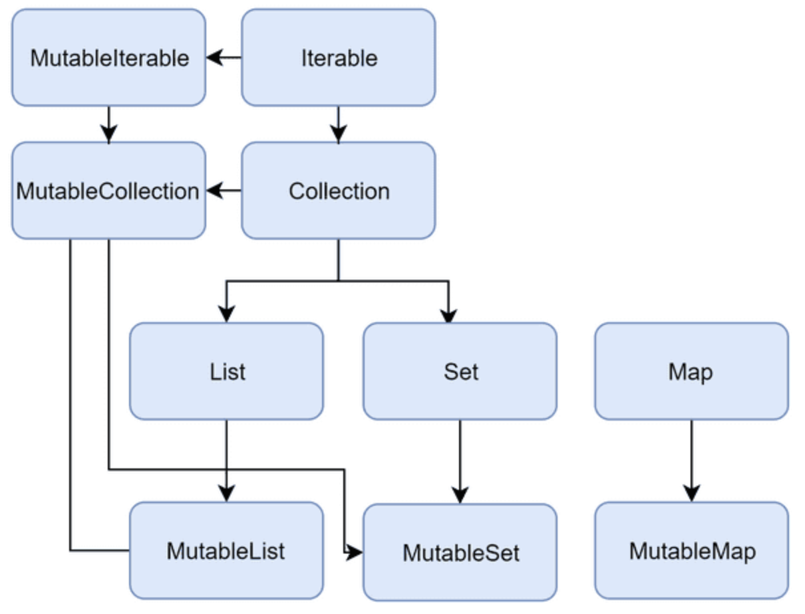

```kotlin
class BankAccount {
	var balance = 0.0
	private set

	fun deposit(depositAmount: Double) {
		balance += depositAmount
	}
	
	@Throws(InsufficientFunds::class)
	fun withdraw(withdrawAmount: Double) {
		if (balance < withdrawAmount) {
			throw InsufficientFunds()
		}
		balance -= withdrawAmount
	}
}

class InsufficientFunds : Exception()
val account = BankAccount()
println(account.balance) // 0.0
account.deposit(100.0)
println(account.balance) // 100.0
account.deposit(50.0)
println(account.balance) // 50.0
```

본 책에 존재하는 코드는 BankAccount에는 계좌에 돈이 얼마나 있는지 나타내는 상태가 있다.  
위 코드가 작동 동작에 대해서는 문제가 없지만, 상태를 적절하게 관리하기 위해서는 어려움이 존재한다.

> 상태를 관리하기 어려운 이유
> 1. 프로그램을 이해하고 디버그하는데 어려움이 존재한다.
> 2. 가변성(mutability) 있으면, 코드의 실행을 추적하기 어려움이 존재한다.
> 3. 멀티스레드 프로그램 상황에서 적절한 동기화가 필요하다.
> 4. 테스트가 어렵다. 모든 상태를 테스트해야하기에 변경이 많아질수록 더 많은 조합을 테스트해야 한다.
> 5. 상태 변경이 일어나면, 변경을 다른 부분에 알려야 한다. 정렬해야 하는 리스트에 새로운 가변 값이 추가되면, 리스트를 다시 정렬하라고 알려줘야 한다.

가변성은 생각보다 단점이 많아서 완전하게 제한하는 프로그래밍 언어가 있다. 가변성은 시스템의 상태를 나타내기 위한 중요한 방법이다. 하지만 변경이 일어나야 하는 부분은 신중, 확실하게 결정하고 사용해야 한다.

## 코틀린에서 가변성 제한하기

코틀린은 가변성을 제한할 수 있게 설계되어 있다.  

- 읽기 전용 프로퍼티(val)
- 가변 컬렉션과 읽기 전용 컬렉션 구분하기
- 데이터 클래스의 copy


1. **읽기 전용 프로퍼티(val)**
- 마치 값(value)처럼 동작하며, 일반적인 방법으로 값이 변하지 않는다.  
  (읽고 쓸 수 있는 경우는 var 활용할 수 있다.)  
```kotlin
val a = 10
a = 20 // 오류
```

- 읽기 전용 프로퍼티가 완전히 변경 불가능한 것은 아니다. mutable 객체를 담고 있다면, 내부적으로 변할 수 있다.  
```kotlin
val list = mutableListOf(1, 2, 3)
list.add(4)
print(list) // [1, 2, 3, 4]
```

- 읽기 전용 프로퍼티는 다른 프로퍼티를 활용하는 사용자 정의 게터로도 정의가 가능하다.
```kotlin
var name: String = "Marcin"
var surname: String = "Moskala"
val fullName
	get() = "$name $surname"

fun main() {
	println(fullName) // Marcin Moskala
	name = "Maja"
	println(fullName) // Maja Moskala
}
```

- var은 게터와 세터를 모두 제공하지만, val은 변경이 불가능하므로 게터만 제공한다.  
  그래서 val은 var로 오버로드 할 수 있다.
```kotlin
interface Element {
    var active: Boolean
}

class ActualElement: Element {
    override var active: Boolean = false
}
```

- val은 정의 옆에 상태가 바로 적히기 때문에, 코드의 실행을 예측하는 것이 훨씬 간단하며, 스마트 캐스트 등의 추가적인 기능을 활용할 수 있다.
- fullName은 게터로 정의했으므로 스마트 캐스트를 할 수 없다. 게터를 활용하므로, 값을 사용하는 시점의 name에 따라서 다른 결과가 나올 수 있기 때문이다.
```kotlin
val name: String? = "Marton"
val surname: String = "Braun"

val fullName: String?
    get() = name?.let { "$it $surname" }

val fullName2: String? = name?.let { "$it $surname" }

fun main() {
    if (fullName != null) {
        println(fullName.length) // 오류
    }

    if (fullName2 != null) {
        println(fullName2.length) // 12
    }
}
```

2. **가변 컬렉션과 읽기 전용 컬렉션 구분하기**
  
- 읽기 전용 인터페이스 > Iterable, Collection, Set, List
- 읽고 쓸 수 있는 인터페이스 > MutableIterable, MutableCollection, MutableSet, MutableList 
- `Iterable<T>.map`, `Iterable<T>.filter` 함수는 ArrayList를 리턴한다.
  실질적으로 코틀린이 내부적으로 immutable하지 않은 컬렉션을 외부적으로 immutable하게 보이게 만들어서 얻어지는 안정성입니다.  
```kotlin
inline fun <T, R> Iterable<T>map(
	transformation: (T) -> R
): List<R> {
	val list = ArrayList<R>()
	for (elem in this) {
		list.add(transformation(elem))
	}
	return list
}
```
- 컬렉션 다운캐스팅은 읽기 전용으로 리턴하였는데, 이를 읽기 전용으로만 사용하지 않는 계약을 위반하고, 추상화를 무시하는 행위이다. 이런 코드는 아전하지 않으며, 예측하지못한 결과를 초래한다.
```kotlin
val list = listOf(1, 2, 3)

// 이렇게 하지 마세요
if (list is MutableList) {
	list.add(4)
}

// 이렇게 사용하세요
val mutableList = list.toMutableList()
mutableList.add(4)
```

3. 데이터 클래스의 copy
- String과 Int처럼 immutable 객체 사용의 장점
  > 1. 한 번 정의된 상태가 유지되므로, 코드를 이해하기 쉽다.
  > 2. immutable 객체는 공유했을 때도 충돌이 따로 이루어지지 않으므로, 병렬 처리를 안전하게 할 수 있다.
  > 3. immutable 객체 대한 참조는 변경되지 않으므로, 쉽게 캐시가 가능하다.
  > 4. immutable 객체는 방어적 복사본(defensive copy)을 만들 필요가 없다. 또한 객체를 복사할 때 깊은 복사를 따로 하지 않아도 된다.
  > 5. immutable 객체는 다른 객체를 만들 때 활용하기 좋다.
  > 6. immutable 객체는 set, map의 키로 사용할 수 있다. mutable 객체는 이러한 것으로 사용할 수 없다. 내부적으로 해시 테이블을 사용하고 있고, 해시 테이블은 처음 요소를 넣을 떄 요소의 값을 기반으로 버킷을 결정하기 때문이다.
```kotlin
val names: SortedSet<FullName> = TreeSet()
val person = FullName("AAA", "AAA")
names.add(person)
names.add(FullName("BBB", "BBB"))
names.add(FullName("CCC", "CCC"))

print(s) // [AAA AAA, BBB BBB, CCC CCC]
print(person in names) // true

person.name = "ZZZ"
print(names) // [ZZZ AAA, BBB BBB, CCC CCC]
print(person in names) // false
```

- mutable 객체는 예측하기 어려우며 위험하는 단점이 있다. 반면 immutable 객체는 변경할 수 없다는 단점이 있다. 따라서, immutable 객체는 자신의 일부를 수정한 새로운 객체를 만들어 내는 메서드가 필요로 하다.
```kotlin
class User (val name:String, val surname: String) {
	fun withSurname(surname: String) = User(name, usrname)
}

var user = User("AAA", "BBB")
user = user.withSurname("CCC")
print(user) // User(name="AAA", surname="CCC")
```

- 모든 프로퍼티를 대상으로 이런 함수를 하나하나 만들기 귀찮기 때문에, data 한정자를 사용하면 된다.
```kotlin
data class User (val name:String, val surname: String)

var user = User("AAA", "BBB")
user = user.copy("CCC")
print(user) // User(name="AAA", surname="CCC")
```

## 다른 종류의 변경 가능 지점
변경할 수 있는 리스트를 만든다고 가정할 때, 2가지 선택지가 존재한다.
> mutable 컬렉션 만들기
> var로 읽고 쓸 수 있는 프로퍼티 만들기

```kotlin
val list1: MutableList<Int> = mutableListOf()
val list2: List<Int> = listOf()

list1.add(1)
list2 = list2 + 1

list1 += 1 // list1.plusAssign(1)로 변경된다.
list2 += 1 // list2 = list2.plus(1)로 변경된다.
```

전자의 경우 구체적인 리스트 구현 내부에 변경 가능 지점이 있어, 멀티스레드 처리가 이루어질 경우, 내부적으로 적절한 동기화가 되어 있는지 알 수 없어 위험한다.  

후자의 경우 프로퍼티 자체가 변경 가능 지점이라 멀티스레드 처리의 안전성이 더 좋다.(잘못 만들면 일부 요소가 손실될 수도 있다.)
```kotlin
var list = listOf<Int>() 
	for (i in 1..1000) {
		thread {
		list = list + i
	}
}
Thread.sleep(1000)
print(list.size) // 1~1000을 더한 값이 되지 않는다. 실행할 때마다 다른 숫자가 나온다
```

mutable 리스트 대신 mutable 프로퍼티를 사용하는 형태는 사용자 정의 세터를 활용해서 변경을 추적할 수 있다.
```kotlin
var names by Delegates.observable(listOf<String>()) { _, old, new -> 
	println("Names changed from $old to $new")
}

names += "Fabio" // Names changed from [] to [Fabio]
names += "Bill" // Names changed from [Fabio] to [Fabio, Bill]
```

프로퍼티와 컬렉션을 모두 변경 가능한 지점으로 만드는 것은 **최악** 이다.
```kotlin
// 이렇게 하지 마세요.
var list3 = mutableListOf<Int>()
```

## 변경 가능 지점 노출하지 말기

mutable 객체를 외부에 노출하는건 위험하다.
```kotlin
data class User(val name: String) 

class UserRepository {
	private val storedUsers: MuatableMap<Int, String> = mutableMapOf()

	fun loadAll(): MutableMap<Int,String> {
		return storedUsers
	}

	//...
}

// loadAll을 사용해서 private
val userRepository = UserRepository()

val storedUsers = userRepository.loadAll() 
storedUsers[4] = "Kirill"
//...

print(userRepository.loadAll()) // {4=Kirill}
```

이러한 코드는 돌발적인 수정이 일어날 때 위험하다. 위를 해결하기 위한 방법은 2가지가 존재한다.

1. 리턴되는 Mutable 객체를 복제(방어적 복제(defensive copying))  
   이때 data 한정자로 만들어지는 copy 메서드 활용하면 좋다.
```kotlin
class UserHolder {
	private val user: MutableUser()

	fun get(): MutableUser {
		return user.copy()

		//...
	}
}
```

2. 가변성을 제한 (추천)
   컬렉션은 객체를 읽기 전용 슈퍼타입으로 업캐스팅 하여 가변성을 제한된다.
```kotlin
class UserRepository {
	private val storedUsers: MuatableMap<Int, String> = mutableMapOf()

	fun loadAll(): Map<Int,String> {
		return storedUsers
	}

	//...
}
```

## 정리

- var보다는 val을 사용하는 것이 좋다.
- mutable 프로퍼티보다는 immutable 프로퍼티를 사용하는 것이 좋다.
- mutable 객체와 클래스보다는 immutable 객체와 클래스를 사용하는 것이 좋다.
- 변경이 필요한 대상을 만들어야 한다면, immutable 데이터 클래스로 만들고 copy를 활용하는 것이 좋다.
- 컬렉션에 상태를 저장해야 한다면, mutable 컬렉션보다는 읽기 전용 컬렉션을 사용하는 것이 좋다.
- 변이 지점을 적절하게 설계하고, 불필요한 변이 지점은 만들지 않는 것이 좋다.
- mutable 객체를 외부에 노출하지 않는 것이 좋다.

```toc
```